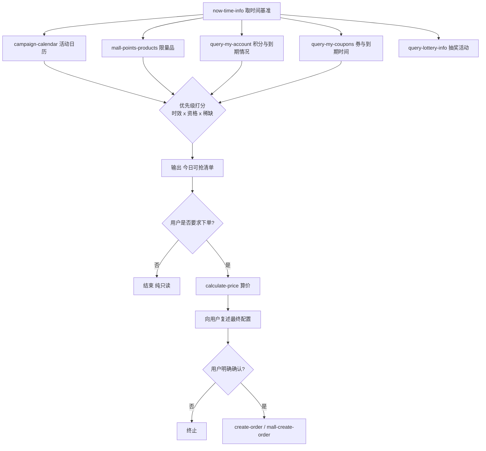

# MCP 接入说明 · 麦麦上新日 MCD Drop Day

本文档说明本项目所依赖的麦当劳中国官方 MCP 服务、实际使用的 Tool、完整调用流程与业务价值。

---

## 一、MCP Server 概况

| 项目 | 内容 |
|---|---|
| 提供方 | 麦当劳中国（McDonald's China） |
| 覆盖范围 | 中国大陆（不含港澳台） |
| 接入地址 | `https://mcp.mcd.cn` |
| 传输协议 | Streamable HTTP |
| 鉴权方式 | 请求头 `Authorization: Bearer <MCP_TOKEN>` |
| 协议版本 | `2025-06-18`（官方 README 标注支持的最高版本） |
| 限流策略 | 每 Token 每分钟 600 次，超限返回 `429` |
| Token 获取 | https://open.mcd.cn/mcp —— 手机号登录 → 控制台 → 激活 → 同意协议 → 复制 |

### 配置示例

```json
{
  "mcpServers": {
    "mcd-mcp": {
      "type": "streamablehttp",
      "url": "https://mcp.mcd.cn",
      "headers": {
        "Authorization": "Bearer YOUR_MCP_TOKEN"
      }
    }
  }
}
```

---

## 二、实际使用的 Tool 清单

官方服务共开放 33 个工具，本 Skill 按职责选用其中 17 个，全部为真实调用。

### 2.1 情报采集层（只读）

| Tool | 官方名称 | 在本 Skill 中的作用 |
|---|---|---|
| `now-time-info` | 获取当前时间信息 | 统一时间基准，判断「今天/本月/还剩几天」 |
| `campaign-calendar` | 活动日历查询工具 | 拉取当月营销活动，区分进行中/往期/未来 |
| `mall-points-products` | 查询麦麦商城商品列表 | **核心**：限量周边与实物兑换品的来源 |
| `mall-product-detail` | 查询麦麦商城商品详情 | 精确读取单个商品的积分门槛与有效期 |
| `query-lottery-info` | 查看积分抽奖活动信息 | 判断是否存在抽奖路径及其消耗规则 |

### 2.2 资格核算层（只读）

| Tool | 官方名称 | 在本 Skill 中的作用 |
|---|---|---|
| `query-my-account` | 我的积分查询 | **核心信号**：可用积分、冻结积分、即将过期积分 |
| `query-my-coupons` | 我的优惠券查询 | 识别临期券，纳入到期资产清算 |
| `available-coupons` | 麦麦省券列表查询 | 发现尚未领取的可领券 |
| `query-store-coupons` | 查询门店可用优惠券 | 核对该门店下券的真实可用性 |

### 2.3 主题活动链路（四级串行）

| Tool | 官方名称 | 依赖上游 |
|---|---|---|
| `query-party-city` | 主题活动城市列表查询 | — |
| `query-party-store` | 主题活动门店列表查询 | `cityId` ← 上一步 |
| `query-partystore-date` | 主题活动可预约日期查询 | `storeId` ← 上一步 |
| `query-partystore-session` | 主题活动可预约日期场次查询 | 门店 + 日期 ← 上一步 |

### 2.4 点餐与下单层（写实，默认锁定）

| Tool | 官方名称 | 安全策略 |
|---|---|---|
| `query-nearby-stores` | 查询附近可用门店 | 只读 |
| `query-meals` | 查询当前可售卖的餐品列表 | 只读 |
| `calculate-price` | 商品价格计算 | 只读，**下单前必过关卡** |
| `create-order` | 创建订单 | 写实，需 `MCD_ALLOW_WRITE=1` + 用户确认 |
| `mall-create-order` | 积分兑换商品下单 | 写实，同上 |
| `party-order-create` | 主题活动订单创建 | 写实，同上 |
| `cancel-order` | 取消订单 | 写实，同上 |
| `list-nutrition-foods` | 餐品营养信息列表 | 只读，仅在用户明确问营养时调用 |

> 另有 `order-list` / `query-order` / `draw-lottery` / `query-my-prizes` 等工具支持追加场景，当前版本预留接口。

---

## 三、调用流程

### 3.1 主流程：上新雷达



### 3.2 主题活动预约链路

```
query-party-city  →  query-party-store  →  query-partystore-date
      ↓                    ↓                      ↓
   cityId              storeId                 date
                                                  ↓
                                    query-partystore-session  →  party-order-create
```

**每一级的入参严格取自上一级返回，严禁凭空构造 ID。** 这是本链路唯一正确的走法。

### 3.3 协议握手（实现细节）

```
POST https://mcp.mcd.cn
Headers: Authorization: Bearer <token>
         Content-Type: application/json
         Accept: application/json, text/event-stream

1. initialize          { protocolVersion: "2025-06-18", clientInfo: {...} }
   ← 响应头可能带回 Mcp-Session-Id，客户端本地缓存
2. notifications/initialized
3. tools/list          或  tools/call { name, arguments }
   → 后续请求携带 Mcp-Session-Id
```

响应体可能是 `application/json`，也可能是 `text/event-stream`。本项目的
`McpClient._parse_body()` 同时处理两种形态，从 SSE 中提取 `data:` 行反序列化。

---

## 四、业务价值

### 4.1 对用户

| 痛点 | 传统做法 | 本 Skill |
|---|---|---|
| 不知道什么时候上新 | 手动刷 App / 刷社媒 | 一条命令拉当天全部在售限量品 |
| 不知道自己够不够格 | 自己算积分、自己找兑换入口 | 自动算出「够/还差多少」并排序 |
| 积分白白过期 | 事后才发现 | 主动读取即将过期字段，倒推可换清单 |
| 派对预约查不全 | 城市门店日期场次逐个试 | 四级链路一次查到可选场次 |

### 4.2 对麦当劳

**把沉睡资产变成被感知的价值。**
积分 redemption 的最大障碍不是「不想换」，而是「不知道能换什么、怕错过」。本 Skill 把「感知成本」降到接近于零，用户在最容易被触达的时刻（东西刚上新、积分快过期）收到明确提示，直接抬升会员资产的流转效率。

同时，这些活动数据本身就是营销日历 —— 打通查、算、约、买，活动参与的转化路径由「多 App 跳转」压缩成「一句话」。

### 4.3 对开发者生态

麦当劳 MCP 开放了 33 个工具，但真正被广泛使用的集中在点餐和营养两类。
本项目示范了 `mall-*` 系列与 `query-party-*` 系列这两组**低使用率但高价值**工具的完整接法，包括：
- Streamable HTTP 的 session 复用
- JSON / SSE 双响应体解析
- 多级依赖链路的严格串行编排
- 写实工具的显式安全闸门设计

---

## 五、错误处理

| 状态码 | 含义 | 本项目处理 |
|---|---|---|
| `401` | Token 无效/过期/缺失 | 提示用户到 https://open.mcd.cn/mcp 重新获取，不猜测 Token |
| `429` | 触发限流（>600 次/分钟） | 降频后重试一次，仍失败则停止并告知 |
| 工具返回空列表 | 当前无数据 | 如实说明，**不用示例数据填充** |
| 返回缺字段 | 数据未开放 | 标注「未提供」，不推测不补全 |

---

## 六、免责说明

本项目为麦当劳程序员节创意开发大赛参赛作品，由参赛者独立开发，**非麦当劳官方产品**。
所有餐品信息、价格、库存与活动状态以麦当劳官方渠道的实时返回结果为准。
